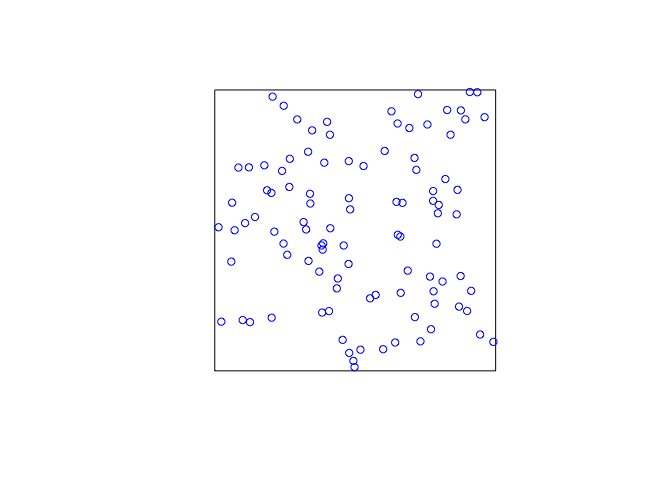
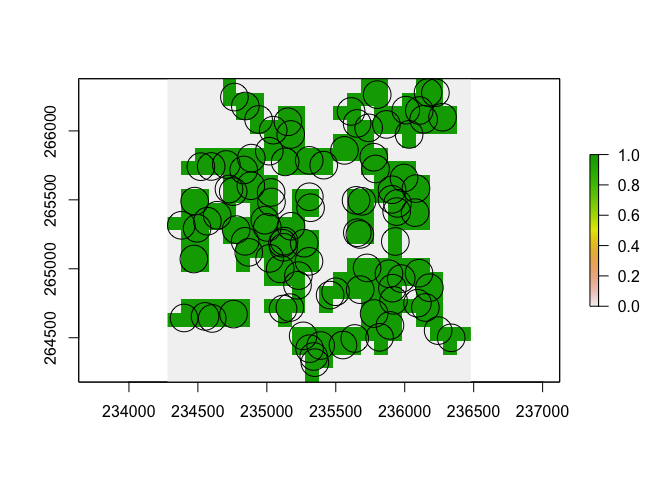

README
================
Matthew Whittle
27/06/2020

# spatialutils

Utility functions for processing spatial data.

# Installation

The package can be installed from github:

``` r
# install.packages("devtools)
# devtools::install_github("matthewjwhittle/spatialutils")
library(spatialutils)
```

    ## Warning: replacing previous import 'dplyr::select' by 'raster::select' when
    ## loading 'spatialutils'

    ## Warning: replacing previous import 'dplyr::intersect' by 'raster::intersect'
    ## when loading 'spatialutils'

    ## Warning: replacing previous import 'dplyr::union' by 'raster::union' when
    ## loading 'spatialutils'

``` r
library(tidyverse)
```

    ## ── Attaching packages ──────────────────────────────────────────────── tidyverse 1.2.1 ──

    ## ✓ ggplot2 3.2.0     ✓ purrr   0.3.4
    ## ✓ tibble  3.0.1     ✓ dplyr   1.0.0
    ## ✓ tidyr   1.0.0     ✓ stringr 1.4.0
    ## ✓ readr   1.3.1     ✓ forcats 0.4.0

    ## Warning: package 'tibble' was built under R version 3.6.2

    ## Warning: package 'purrr' was built under R version 3.6.2

    ## Warning: package 'dplyr' was built under R version 3.6.2

    ## ── Conflicts ─────────────────────────────────────────────────── tidyverse_conflicts() ──
    ## x dplyr::filter() masks stats::filter()
    ## x dplyr::lag()    masks stats::lag()

``` r
library(sf)
```

    ## Warning: package 'sf' was built under R version 3.6.2

    ## Linking to GEOS 3.7.2, GDAL 2.4.2, PROJ 5.2.0

``` r
library(raster)
```

    ## Loading required package: sp

    ## Warning: package 'sp' was built under R version 3.6.2

    ## 
    ## Attaching package: 'raster'

    ## The following object is masked from 'package:dplyr':
    ## 
    ##     select

    ## The following object is masked from 'package:tidyr':
    ## 
    ##     extract

# Examples

## Generating a points object

``` r
x <- c(435532, 325646)
y <- c(235353, 265293)
points <- xy_to_points(x, y)
# View the sf object
print(points)
```

    ## Simple feature collection with 2 features and 0 fields
    ## geometry type:  POINT
    ## dimension:      XY
    ## bbox:           xmin: 325646 ymin: 235353 xmax: 435532 ymax: 265293
    ## CRS:            EPSG:27700
    ## # A tibble: 2 x 1
    ##          geometry
    ##       <POINT [m]>
    ## 1 (435532 235353)
    ## 2 (325646 265293)

``` r
# Plot the sf object
plot(points)
```

<!-- -->

# Generating Random Points

``` r
# Generate a bounding box
bbox <- xy_to_points(x = 235353, y = 265293, crs = 27700) %>% 
  # Buffer the point and calculate the bounding box
  st_buffer(dist = 1000) %>% st_bbox()

# Generate random points within the bounding box
sample_points <- random_points(bbox = bbox, n_points = 100, seed = 1)

# Plot the bounding box and the points
plot(st_as_sfc(bbox)) # Convert the bounding box to sfc for plotting
# Add the points to the plot
plot(sample_points, add =TRUE, col = "blue")
```

<!-- -->

# Getting raster of the coverage

``` r
# Buffer the points - which converts them to a polygon
buffers <- st_buffer(sample_points, 100)
plot(buffers)
```

<!-- -->

``` r
# Create a model raster with a 100m resolution
model_raster <- sf_to_raster(sf = buffers, resolution = 100)

# Calculate the cover raster from the sf
cover_raster <- get_cover(buffers, model_raster)

# Plot the buffers and their cover raster
plot(cover_raster)
plot(buffers, add = T)
```

<!-- -->
