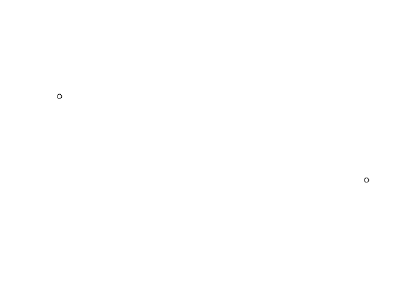

spatialutils
================

Utility functions for processing spatial data.

# Installation

The package can be installed from github:

``` r
install.packages("devtools)
devtools::install_github("matthewjwhittle/spatialutils")
```

Load other packages:

``` r
library(spatialutils)
library(tidyverse)
library(sf)
library(raster)
```

# Examples

## Generating a points object

``` r
x <- c(435532, 325646)
y <- c(235353, 265293)
points <- xy_to_points(x, y)
# View the sf object
print(points)
```

    ## Simple feature collection with 2 features and 0 fields
    ## geometry type:  POINT
    ## dimension:      XY
    ## bbox:           xmin: 325646 ymin: 235353 xmax: 435532 ymax: 265293
    ## CRS:            EPSG:27700
    ## # A tibble: 2 x 1
    ##          geometry
    ##       <POINT [m]>
    ## 1 (435532 235353)
    ## 2 (325646 265293)

``` r
# Plot the sf object
plot(points)
```

<!-- -->

# Generating Random Points

``` r
# Generate a bounding box
bbox <- xy_to_points(x = 235353, y = 265293, crs = 27700) %>% 
  # Buffer the point and calculate the bounding box
  st_buffer(dist = 1000) %>% st_bbox()

# Generate random points within the bounding box
sample_points <- random_points(bbox = bbox, n_points = 100, seed = 1)

# Plot the bounding box and the points
plot(st_as_sfc(bbox)) # Convert the bounding box to sfc for plotting
# Add the points to the plot
plot(sample_points, add =TRUE, col = "blue")
```

<!-- -->

# Getting raster of the coverage

``` r
# Buffer the points - which converts them to a polygon
buffers <- st_buffer(sample_points, 100)
plot(buffers)
```

<!-- -->

``` r
# Create a model raster with a 100m resolution
model_raster <- sf_to_raster(sf = buffers, resolution = 100)

# Calculate the cover raster from the sf
cover_raster <- get_cover(buffers, model_raster)

# Plot the buffers and their cover raster
plot(cover_raster)
plot(buffers, add = T)
```

<!-- -->
